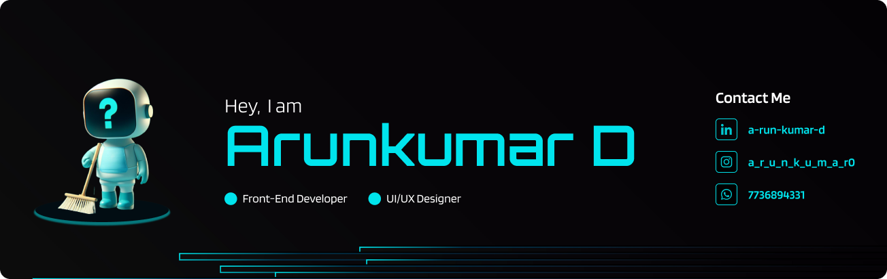

🌱 I’m currently learning Astro, Typescript, and Back-end Development 💬 Ask me about React , Figma , Design ⚡ Fun fact Dark Green is the best color

***

#### 🌐 Socials:
      

#### 💻 Tech Stack:
           

#### 📊 GitHub Stats:

---

